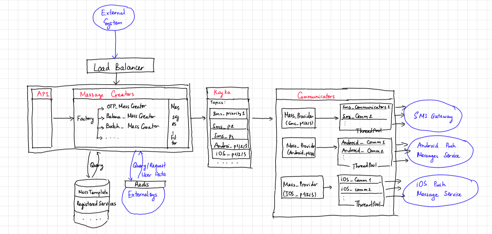
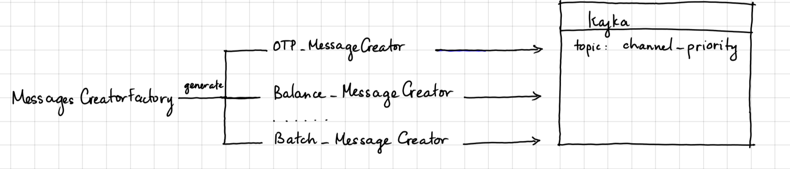
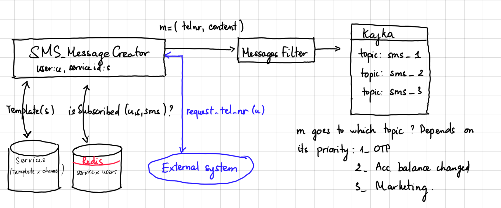
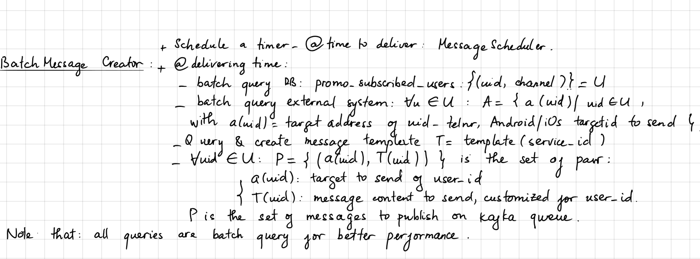
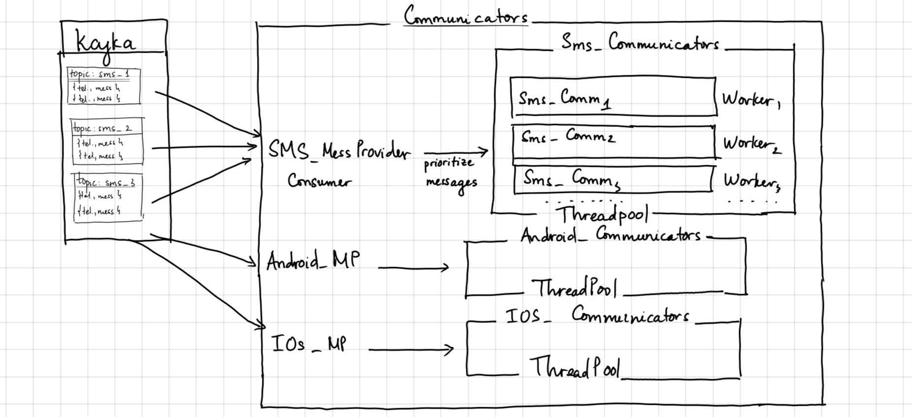
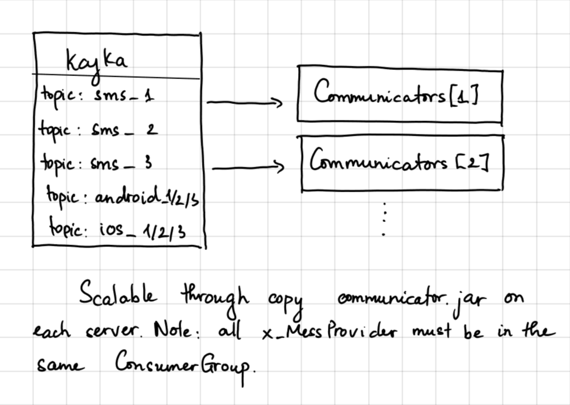

# Push-Notification System (PNS)
This document sketches out the architect of a system, which delivers push-notifications of an e-bank via sms or mobile. Content:
- Overview
- Components
- Typical User flows
- Discussion
## Overview

Some requirements: this system should NOT know any sensitive data. They usually got strictly security requirements and complicated updating mechanism. To separate concerns, those data should be in another system.
- All PNS knows about user is user_id
- OTP must be generated from other system
### Main components: 
- **API components**: expose services to external systems
- **Message Creators**: using data sources to create full message from API request (e.g: fill in phone number, full message content), and publish it to Messages Broker
- **Database**: contains message templates, service subscriptions ...
- **Messages Broker**: Kafka - connect Message Creators (publishers) and Communicators (subscribers)
- **Communicators**: send out message as SMS or push message to iOs/Android devices. Note that, at this layer, communicators do NOT need know anything else except the target to send (e.g: phone number) and message content
- **Loggers**: logging for system monitoring/debug or data mining later on

### Typical message flow:
1. Extern system request Authorization token from API system
2. An **API** request is sent to PNS from external system
3. From that API: 
   - A **MessageCreator** will be generated (The MessageCreator Factory will generate the corresponding Creator base on API request type) 
   - The MessageCreator will query database (Message pattern, subscribed services for user) and request more data from external system (e.g: phone number) to create the full message
   - The message will go through MessagesFilter to check if it is satisfied all conditions to be sent out
4. The message will be published on **Kafka** in topic: "channel_priority" - the priority depends on type of the API request:
   - High priority = 1: OTP 
   - Medium priority = 2: Account balance changed
   - Low priority = 3: Batch marketing message
   - Why number ? To extern the system later on, if we need more level of priorities  
Currently there would be 3 x 3 topics: "sms_1","sms_2","sms_3", "android_1/2/3", "ios_1/2/3"
5. Messages from Kafka will be fed into **Communicators** - there are 3 types of Communicators: SMS_Communicators, Android_Communicators, iOS_Communicators - their responsibility is delivering message to SMS-Gateway, Android Push Message Service (FCB), iOS Push Message Service. High priority messages will ALWAYS be served first, even if the lower priority messages came to Kafka first. That is the responsibility of module Communicators.MessagesProvider

### Main technologies:
 - Main Framework: Java/Spring Boot
 - Messages Broker: Kafka
 - Database/Cache: PostgreSQL, Redis
 - Testing/CI/CD: JUnit/Mockito, Maven, Shell, Git
 - Loggers: ELK or Zipkin + RabbitMQ
 - Documentation: Swagger

Nothing much to discuss this, because your company is using Java - so those techs are pretty standard. We will talk about microservices in 'Discussion' part.

## Components
### API
- Technology: Spring Boot, Tomcat, Load balancing: Tomcat Connectors
- List of APIs:
  + account_balance_changed(user_id, old_balance, new_balance)
  + service_id = create_service(description, message_template, channel)
  + register_service(user_id, service_id)
  + unregister_service(user_id, service_id)
  + subscribe_promotion_service(user_id, channel)
  + unsubscribe_promotion_service(user_id, channel)
  + get_promo_services(): return all promotion marketing services, for operator frontend
  + send_OTP(user_id, channel)    
  + edit_service(service_id,new_desc, new_mess_template, new_channel)
  + send_batch_message(service_id)
  
- Security: all API must be authorized (SpringSecurity)

## Message Creators

This module receives request from API module, query other data sources to fill message content, target (e.g: telephone number) - then publish message on Kafka.
To separate concerns, each kind of message will be processed by a specific class (e.g: SMS_MessageCreators process sms notification services) - those Creators are generated by **MessageCreatorFactory**

**OtpMessageCreator** , **BalanceMessageCreator** got similar design

  

**BatchMessagesCreator** send out promotion messages - note that all queries are batch queries for better performance

- **Messages** filter: At first let all messages go through, but Open to Extension - Close to Modification, right ?
  - For later extension: limit of notification per user per day
  - Some kind of criteria (with AND/OR conditions)

## Databases and external systems
### External system
Because some sensitive/personal data should not be contained in PNS - they must be queried from external system.
They are OTP, telnr, and android/ios id for users. Those system should support batch queries for better performance.
A Redis-cache layer should be implemented in case of re-query (e.g: customer request OTP again in case of slow response). But the cache expired time should not be too long (user may update telephone number, buy new phone, reinstall app .... )

### Databases
- Technology: String Boot framework, Hibernate, JDBC, JPA
- Tables:
  - DB.services: 
    - Fields: service_id, template_message, channel, service_type (otp|balance|loan...)
    - Contains data for each service - and channel for that service, note that the same service with different channel are different services
  - DB.promo_subscribed_services:
    - Fields: service_id, user_id
    - This table should be separated from normal services for better performance
  - DB.subscribed_services:
    - Fields: user_id, service_id
    - Contains data for registered services by users
    - Should have redis-cache
- Database resiliency: should be replicated over several regions/zones - and should have switching to back-up db in case of corruption. There must be a tool for that. Open for discussion, I got zero knowledge on this topic

## Message Broker: Kafka
Messages got priority: OTP 1m > Account balance changed 5m > Bach Marketing message 4h for 10M users.  
So the system is designed such that the messages with higher priority are always delivered before the lower ones.
There must be some way that the Communicators know that priority, we achieve it by encoding the priority to Kafka Topic.  
Another information is encoded into topics is the channel of message: sms, Android, iOS .. Thus, the topic got the form
Channel_priority:
- sms_1, sms_2, sms_3
- android_1, android_2, android_3
- ios_1, ios_2, ios_3 

The producers are MessageCreators - Consumers are Communicators.MessagesProvider
## Communicators
Communicators receive messages from Kafka and send it to users. SMS goes to SMS_Communicators and are delivered via SMS-Gateway, 
Android/iOS messages go to Android/iOS_Communicator and are delivered through their mobile push message service 

There is still one problem through: How to prioritize messages ? 
That is the responsibility of x-MessageProvider.   
We will describe SMS-Communicators modules,
because Android/iOS modules work the same way.

### Message Provider
SMS-MessageProvider consumes Kafka topics: sms_1, sms_2, sms_3, it polls messages from those topics 
then ALWAYS serve the sms_1 first, only when there is no messages with topic sms_1, 
then messages in topic_2, topic_3 are served 

The Message Provider must guaranty 3 things: 
1. High priority messages must be served before the lower ones 
2. Each message is served "exactly-once": ACK & Retry mechanism  
In case of Marketing Message Provider, it's "at-least-once" - no ACK, waiting 
3. Resilient over restarting service - it must store the offset of most recent served message, so in case of corruption, it can resume without losing messages

### Communicators
Communicators are worker thread in a thread-pool. 

The concern of pushing out message are separated in different classes: SMS-Communicator, Android-Communicator, iOS-Communicator

### Scale

The service is easily scaled out horizontally, just add more server and run new communicators.jar.

Note that all SMS-MessageProviders must be in the same Kafka consumer-group (or there will be duplicated messages)

## Typical User flows
### Send OTP 
1. User request OTP from the bank
2. Banking system send request to PNS via API: send_OTP(user_id)
3. creator(user_id) = OTPMessageCreator is created via MessagesCreatorFactory
4. creator(user_id) query target C = { c(user_id) | c : channel of user_id subscribed for OTP service } in Database DB.services }
5. For each channel c(user_id) in C: T = { t | target(user_id) = target to send out message for user_id, query from external system, e.g: telnr or Android/iOS address }
6. Query template T(user_id) from DB.services (same as step 4, in fact, get data from step 4 )
7. Query (otp, expired_time) = OTP(user_id, time_stamp) from external system
8. Publish { (target(user_id), otp, expired_time ) | for all target(user_id)) on corresponding topics, e.g: sms_1, android_1
9. Communicators.MessageProvider poll message from Kafka inside a batch, higher priority topics always served first (e.g: sms_1 > android_3 )
10. Message is distributed to corresponding Communicators, then Communicators send out message to external system:
    - SmsCommunicator send message to SMS-Gateway
    - AndroidCommunicator push message to FCM (Firebase Cloud Message)
    - iOSCommunicator push message to some kind of iOS push message service

### Account balance changed
1. Account balance changed for user_id, banking system call API:  
account_balance_changed(user_id, old_balance, new_balance)
2. creator(user_id) = Balance_MessageCreator is generated via MessagesCreatorFactory
3. The MessageCreator query:
- Channel c for user_id from DB.subscribed_services , row = (service_id, user_id, channel)
- Query target address for channel c from external system (telnr, android/ios address)
- Query template for service_id
4. Create message from those information and publish message on Kafka with corresponding topic, 
e.g: if channel is SMS - the topic should be sms_2 (2 is the priority)
5. Modules from Communicators: MessageProvider & x-Communicators will take their turn
### Batch marketing message
1. Operator will schedule a marketing message for a later time, say 9 A.M next morning
2. APIs create_service(description, message_template, channel) are called (all channels)
3. API send_batch_message(service_id) is called
4. The detailed flow please see in Component.Message Creators.BatchMessagesCreator

### Users subscribe/Unsubscribe service 
1. User subscribe service on banking system
2. Banking system call API register_service(user_id, service_id), note that service contains channel already
3. API write to DB.subscribed_users, row: (user_id, service_id)
Similar for unsubscribe services

### Operator creates template message
1. Operator create the service on his front-end
2. APIs are called: create_service(description, message_template, channel )

## Discussion

### Microservices:
Should be the right solution for the overall design - using Spring Boot Framework:
- Load balancing: Ribbon/Feign/Eureka
- API Gateway: Zuul
- Loggers: ELK
- Much better CI/CD
- Easier to scale
- Much easier to make system resilient over regions/zones failures

### Performance & scalability

- Daily load - avg: 35 req/s , spike: 350-500 req/s  
Load = A1(100k) x avgPerDay(10) / active_hours(8) * 3600. 
This kind of load should not be any problem for standard tech like PostgreSQL, Kafka, or Webserver. We, as coders, still have to design the system such that if there is a problem, the system can be easily scaled horizontally. Thus, the API Webserver (Tomcat) must stay behind a load-balancer (Tomcat Connectors)
- Batch load - 10M / 4h ~ 700 req/s  
This number is not quite small, still not that large, we must be careful with it:
  - Those messages should be processed at-least-once, so the is no waiting for feedback time at the Communicators (not like high priority message, should be exactly-once)
  - The low priority messages should not throttle the delivering of higher priority messages (that's what MessagesProviders do )
  
### Testing/CI/CD: 
  - Stages: Dev, Test, Staging, Production
  - Using git flow with corresponding stages, staging codes must pass all nightly build test
  - Nightly build using crontab + unit-test + pull request to commit into staging stage
  - Shell + Maven to deploy .jar file
  - Tool for testers: Mantis (maybe too old already, open to discuss)

## Other concerns: 
- Security, Backup: This design doesn't pay enough attention to those fields, open to learn from infrastructure/dev-ops guys
- Graceful shutdown: when services down/upgraded, e.g: adding hook to infinite kafka consumer threads 
 

Notes to myself:
- API Authorization: SpringSecurity -> configure: overwrite the SecurityFilterChain
- Design of Batch_MessagesCreator is not so good, even it can satisfy this load, but not so scalable - revise it later