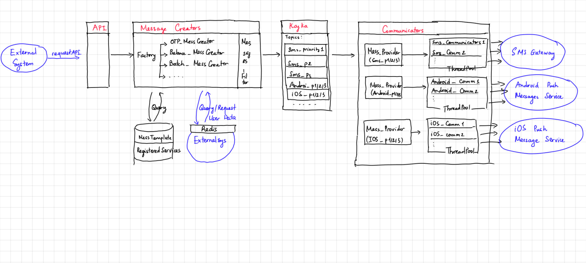

# Push-Notification System (PNS)
This document sketches out the architect of a system, which delivers push-notifications of an e-bank via sms or mobile  
## Overview

Some requirement: this system should NOT know any user data - all it knows about user is user_id.
### Main components: 
- **API components**: load balancing, expose services to external systems
- **Message Creators**: using data sources to create full message from API request (e.g: fill in phone number, full message content), and publish it to Messages Broker
- **Database**: contains message templates, service subscriptions ...
- **Messages Broker**: Kafka - connect Message Creators (publishers) and Communicators (subscribers)
- **Communicators**: send out message as SMS or push message to iOs/Android devices. Note that, at this layer, communicators do NOT need know anything else except the target to send (e.g: phone number) and message content
- **Loggers**: logging for system monitoring/debug or data mining later on
### Main technologies:
 - Main Framework: Java/Spring Boot
 - Messages Broker: Kafka
 - Database/Cache: PostgreSQL, Redis
 - Testing/CI/CD: JUnit/Mockito, Maven, Shell, Git
 - Loggers: ELK

Nothing much to discuss this, because your company is using Java - so those techs are pretty standard. We will talk about microservices in 'Discussion' part.

## Components
## Typical User flows
## Discussion
- Microservices should be the right solution for the overall design - using Spring Boot Framework, 
    + Load balancing: Ribbon/Feign/Eureka
    + API Gateway: Zuul
    + Loggers: ELK
    + Much better CI/CD 
    + Easier to scale

