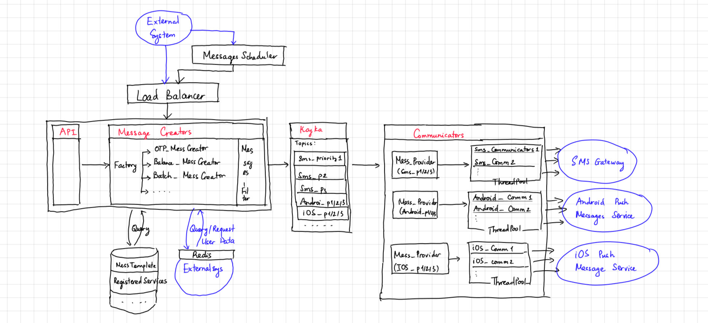

# Push-Notification System (PNS)
This document sketches out the architect of a system, which delivers push-notifications of an e-bank via sms or mobile. Content:
- Overview
- Components
- Typical User flows
- Discussion
## Overview

Some requirements: this system should NOT know any sensitive data. They usually got strictly security requirements and complicated updating mechanism. To separate concerns, those data should be in another system.
- All PNS knows about user is user_id
- OTP must be generated from other system
### Main components: 
- **API components**: expose services to external systems
- **Message Creators**: using data sources to create full message from API request (e.g: fill in phone number, full message content), and publish it to Messages Broker
- **Database**: contains message templates, service subscriptions ...
- **Messages Broker**: Kafka - connect Message Creators (publishers) and Communicators (subscribers)
- **Communicators**: send out message as SMS or push message to iOs/Android devices. Note that, at this layer, communicators do NOT need know anything else except the target to send (e.g: phone number) and message content
- **Loggers**: logging for system monitoring/debug or data mining later on

### Typical message flow:
1. Extern system request Authorization token from API system
2. An **API** request is sent to PNS from external system
3. From that API: 
   - A **MessageCreator** will be generated (The MessageCreator Factory will generate the corresponding Creator base on API request type) 
   - The MessageCreator will query database (Message pattern, subscribed services for user) and request more data from external system (e.g: phone number) to create the full message
   - The message will go through MessagesFilter to check if it is satisfied all conditions to be sent out
4. The message will be published on **Kafka** in topic: "channel_priority" - the priority depends on type of the API request:
   - High priority = 1: OTP 
   - Medium priority = 2: Account balance changed
   - Low priority = 3: Batch marketing message
   - Why number ? To extern the system later on, if we need more level of priorities  
Currently there would be 3 x 3 topics: "sms_1","sms_2","sms_3", "android_1/2/3", "ios_1/2/3"
5. Messages from Kafka will be fed into **Communicators** - there are 3 types of Communicators: SMS_Communicators, Android_Communicators, iOS_Communicators - their responsibility is delivering message to SMS-Gateway, Android Push Message Service (FCB), iOS Push Message Service. High priority messages will ALWAYS be served first, even if the lower priority messages came to Kafka first. That is the responsibility of module Communicators.MessagesProvider

### Main technologies:
 - Main Framework: Java/Spring Boot
 - Messages Broker: Kafka
 - Database/Cache: PostgreSQL, Redis
 - Testing/CI/CD: JUnit/Mockito, Maven, Shell, Git
 - Loggers: ELK or Zipkin + RabbitMQ
 - Documentation: Swagger

Nothing much to discuss this, because your company is using Java - so those techs are pretty standard. We will talk about microservices in 'Discussion' part.

## Components
### API
- Technology: Spring Boot, Tomcat, Load balancing: Tomcat Connectors
- List of APIs:
  + account_balance_changed(user_id, old_balance, new_balance)
  + service_id = create_service(description, message_template, channel)
  + register_service(user_id, service_id)
  + unregister_service(user_id, service_id)
  + send_OTP(user_id, channel)    
  + edit_service(service_id,new_desc, new_mess_template, new_channel)
  + send_batch_message(service_id, [user_ids] )
- Security: all API must be authorized (SpringSecurity)
- Submodule: **MessageScheduler** This module receive API from Operators to send batch messages to users:  
send_batch_messages(service_id, start_time)
### Messages creator
- Messages filter: At first let all messages go through, but Open to Extension - Close to Modification, right ?
  + For later extension: limit of notification per user per day
  + Some kind of criteria (with AND/OR conditions)
###
## Typical User flows
### Send OTP 
### Account balance changed
### Batch marketing message
### Users subscribe/Unsubscribe service 
### Operator creates template message

## Discussion

### Microservices:
Should be the right solution for the overall design - using Spring Boot Framework:
- Load balancing: Ribbon/Feign/Eureka
- API Gateway: Zuul
- Loggers: ELK
- Much better CI/CD
- Easier to scale
- Much easier to make system resilient over regions/zones failures

### Performance & scalability

- Daily load - avg: 35 req/s , spike: 350-500 req/s  
Load = A1(100k) x avgPerDay(10) / active_hours(8) * 3600. 
This kind of load should not be any problem for standard tech like PostgreSQL, Kafka, or Webserver. We, as coders, still have to design the system such that if there is a problem, the system can be easily scaled horizontally. Thus the API Webserver (Tomcat) must stay behind a load-balancer (Tomcat Connectors)
- Batch load - 10M / 4h ~ 700 req/s  
This number is not quite small, still not that large, we must be careful with it:
  - Those messages should be processed at-least-once, so the is no waiting for feedback time at the Communicators (not like high priority message, should be exactly-once)
  - The low priority messages should not throttle the delivering of higher priority messages (that's what MessagesProviders do )
  
### Testing/CI/CD: 
  - Stages: Dev, Test, Staging, Production
  - Using git flow: ...
  - Nightly build using crontab + unit-test to submit
  - Shell + Maven to deploy .jar file
  - Tool for testers: Mantis (maybe too old already, open to discuss)

## Other concerns: 
- Security, Backup: This design doesn't pay enough attention to those fields, open to learn from infrastructure/dev-ops guys
- Graceful shutdown: when services down/upgraded, e.g: adding hook to infinite kafka consumer threads 
 

Notes to myself:
- API Authorization: SpringSecurity -> configure: overwrite the SecurityFilterChain